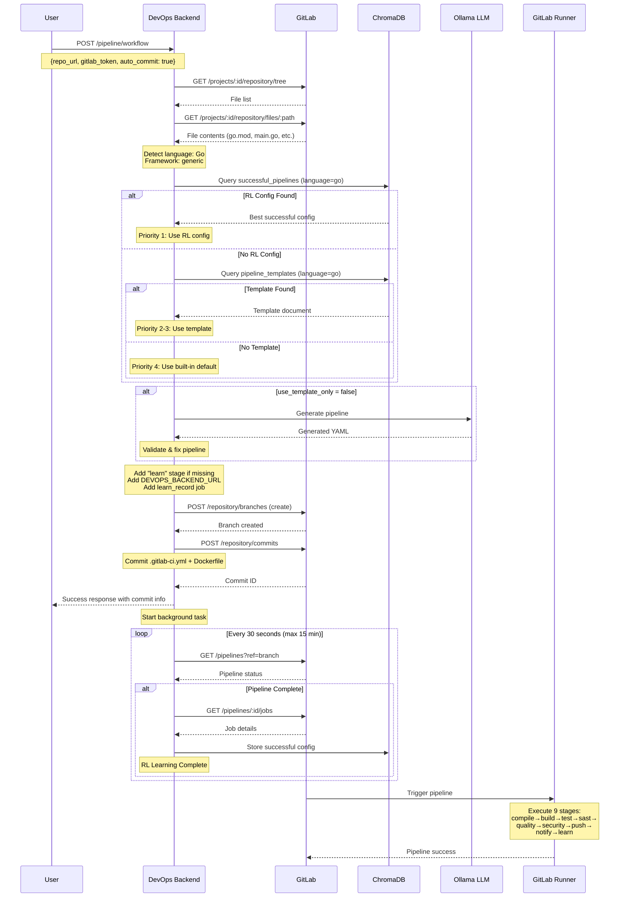
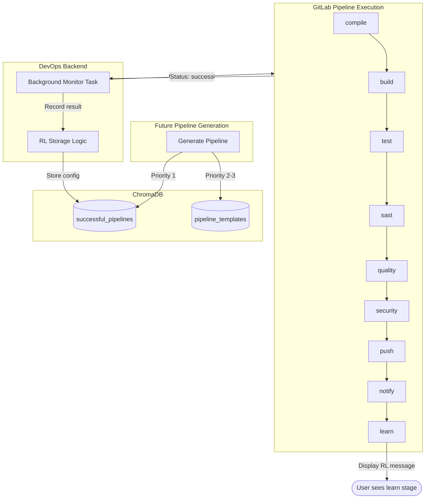
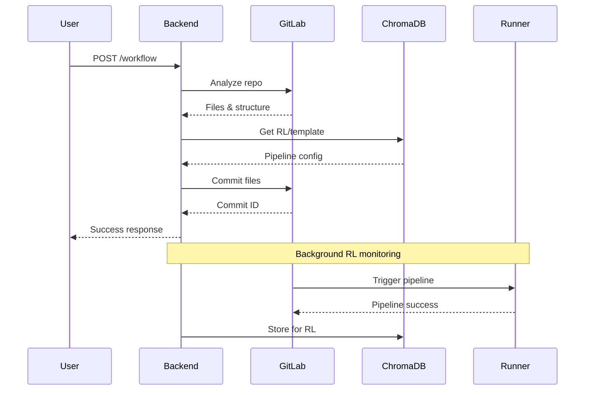
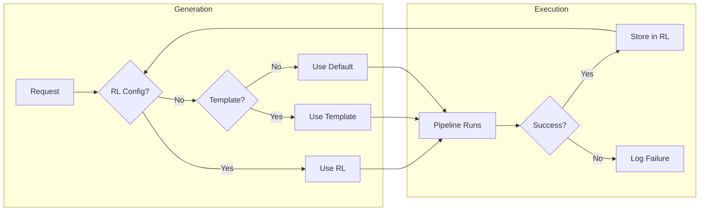

# Sequence & Flow Diagrams

This document contains detailed diagrams for the DevOps Tools Backend system.

---

## 1. Pipeline Generation Workflow

### Sequence Diagram (Full Workflow)



---

## 2. Pipeline Execution Flow

### 9-Stage Pipeline Flow

```
┌─────────────────────────────────────────────────────────────────────────────────┐
│                           GITLAB CI/CD PIPELINE                                  │
│                              (9 Stages)                                          │
└─────────────────────────────────────────────────────────────────────────────────┘

┌──────────┐    ┌──────────┐    ┌──────────┐    ┌──────────┐    ┌──────────┐
│ COMPILE  │───►│  BUILD   │───►│   TEST   │───►│   SAST   │───►│ QUALITY  │
│          │    │          │    │          │    │          │    │          │
│ Build    │    │ Kaniko   │    │ Run unit │    │ Static   │    │ SonarQube│
│ artifact │    │ Docker   │    │ tests    │    │ analysis │    │ scan     │
│ (binary) │    │ image    │    │          │    │ (go vet) │    │          │
└──────────┘    └──────────┘    └──────────┘    └──────────┘    └──────────┘
                                                                      │
                                                                      ▼
┌──────────┐    ┌──────────┐    ┌──────────┐    ┌──────────┐    ┌──────────┐
│  LEARN   │◄───│  NOTIFY  │◄───│   PUSH   │◄───│ SECURITY │◄───│          │
│          │    │          │    │          │    │          │    │          │
│ Record   │    │ Splunk   │    │ Tag &    │    │ Trivy    │    │          │
│ success  │    │ HEC      │    │ push     │    │ scan     │    │          │
│ for RL   │    │ notify   │    │ release  │    │ image    │    │          │
└──────────┘    └──────────┘    └──────────┘    └──────────┘    └──────────┘
```

### Detailed Stage Flow

```
┌─────────────────────────────────────────────────────────────────────────────────┐
│ STAGE 1: COMPILE                                                                │
├─────────────────────────────────────────────────────────────────────────────────┤
│ Image: golang:1.21-alpine                                                       │
│ Script:                                                                         │
│   - go mod download                                                             │
│   - go build -o app .                                                           │
│ Artifacts: app (binary)                                                         │
└─────────────────────────────────────────────────────────────────────────────────┘
                                      │
                                      ▼
┌─────────────────────────────────────────────────────────────────────────────────┐
│ STAGE 2: BUILD                                                                  │
├─────────────────────────────────────────────────────────────────────────────────┤
│ Image: kaniko-executor:debug                                                    │
│ Dependencies: compile (artifact)                                                │
│ Script:                                                                         │
│   - Create /kaniko/.docker/config.json                                          │
│   - /kaniko/executor \                                                          │
│       --destination ai-nexus:5001/apm-repo/demo/${IMAGE_NAME}:${IMAGE_TAG}     │
│       --build-arg BASE_REGISTRY=ai-nexus:5001                                  │
└─────────────────────────────────────────────────────────────────────────────────┘
                                      │
                                      ▼
┌─────────────────────────────────────────────────────────────────────────────────┐
│ STAGE 3: TEST                                                                   │
├─────────────────────────────────────────────────────────────────────────────────┤
│ Image: golang:1.21-alpine                                                       │
│ Script:                                                                         │
│   - go test ./... -v || true                                                    │
│ Allow Failure: true                                                             │
└─────────────────────────────────────────────────────────────────────────────────┘
                                      │
                                      ▼
┌─────────────────────────────────────────────────────────────────────────────────┐
│ STAGE 4: SAST (Static Application Security Testing)                             │
├─────────────────────────────────────────────────────────────────────────────────┤
│ Image: golang:1.21-alpine                                                       │
│ Script:                                                                         │
│   - go vet ./... || true                                                        │
│ Allow Failure: true                                                             │
└─────────────────────────────────────────────────────────────────────────────────┘
                                      │
                                      ▼
┌─────────────────────────────────────────────────────────────────────────────────┐
│ STAGE 5: QUALITY                                                                │
├─────────────────────────────────────────────────────────────────────────────────┤
│ Image: sonarsource-sonar-scanner-cli:latest                                     │
│ Script:                                                                         │
│   - sonar-scanner \                                                             │
│       -Dsonar.projectKey=${CI_PROJECT_NAME} \                                  │
│       -Dsonar.host.url=http://ai-sonarqube:9000 \                              │
│       -Dsonar.token=${SONAR_TOKEN}                                             │
│ Allow Failure: true                                                             │
└─────────────────────────────────────────────────────────────────────────────────┘
                                      │
                                      ▼
┌─────────────────────────────────────────────────────────────────────────────────┐
│ STAGE 6: SECURITY                                                               │
├─────────────────────────────────────────────────────────────────────────────────┤
│ Image: curlimages-curl:latest                                                   │
│ Services:                                                                       │
│   - aquasec-trivy:latest (alias: trivy-server)                                 │
│     Command: /usr/local/bin/trivy server --listen 0.0.0.0:8083                 │
│ Script:                                                                         │
│   - sleep 10  # Wait for Trivy server                                          │
│   - curl -s "http://trivy-server:8083/healthz"                                 │
│ Allow Failure: true                                                             │
└─────────────────────────────────────────────────────────────────────────────────┘
                                      │
                                      ▼
┌─────────────────────────────────────────────────────────────────────────────────┐
│ STAGE 7: PUSH                                                                   │
├─────────────────────────────────────────────────────────────────────────────────┤
│ Image: kaniko-executor:debug                                                    │
│ Script:                                                                         │
│   - /kaniko/executor \                                                          │
│       --destination ai-nexus:5001/apm-repo/demo/${IMAGE_NAME}:${RELEASE_TAG}   │
│ Note: Creates release-tagged image                                              │
└─────────────────────────────────────────────────────────────────────────────────┘
                                      │
                                      ▼
┌─────────────────────────────────────────────────────────────────────────────────┐
│ STAGE 8: NOTIFY                                                                 │
├─────────────────────────────────────────────────────────────────────────────────┤
│ Jobs:                                                                           │
│   notify_success (when: on_success):                                           │
│     - curl Splunk HEC: "Pipeline succeeded"                                     │
│   notify_failure (when: on_failure):                                           │
│     - curl Splunk HEC: "Pipeline failed"                                        │
│ Allow Failure: true                                                             │
└─────────────────────────────────────────────────────────────────────────────────┘
                                      │
                                      ▼
┌─────────────────────────────────────────────────────────────────────────────────┐
│ STAGE 9: LEARN (Reinforcement Learning)                                         │
├─────────────────────────────────────────────────────────────────────────────────┤
│ Image: curlimages-curl:latest                                                   │
│ When: on_success                                                                │
│ Script:                                                                         │
│   - echo "REINFORCEMENT LEARNING - Recording Success"                           │
│   - echo "Pipeline ${CI_PIPELINE_ID} completed successfully!"                   │
│   - echo "This configuration will be stored for future AI pipeline generation" │
│   - echo "RL Status - Backend background task is recording this success"        │
│ Allow Failure: true                                                             │
│                                                                                 │
│ Note: Actual RL storage is done by backend background task                      │
└─────────────────────────────────────────────────────────────────────────────────┘
```

---

## 3. Reinforcement Learning Flow

### RL Data Flow



### RL Priority Selection

```
┌─────────────────────────────────────────────────────────────────────────────────┐
│                    TEMPLATE SELECTION PRIORITY                                   │
└─────────────────────────────────────────────────────────────────────────────────┘

                         ┌─────────────────────┐
                         │ Get Reference       │
                         │ Pipeline            │
                         │ (language, framework)│
                         └──────────┬──────────┘
                                    │
                                    ▼
                    ┌───────────────────────────────┐
                    │ Priority 1: Check RL Storage  │
                    │ (successful_pipelines)        │
                    │                               │
                    │ Query: language=X, framework=Y│
                    └───────────────┬───────────────┘
                                    │
                         ┌──────────┴──────────┐
                         │                     │
                    Found?                Not Found
                         │                     │
                         ▼                     ▼
              ┌─────────────────┐   ┌─────────────────────┐
              │ Return RL       │   │ Priority 2: Check   │
              │ Config          │   │ Templates           │
              │ (proven to work)│   │ (language+framework)│
              └─────────────────┘   └──────────┬──────────┘
                                               │
                                    ┌──────────┴──────────┐
                                    │                     │
                               Found?                Not Found
                                    │                     │
                                    ▼                     ▼
                         ┌─────────────────┐   ┌─────────────────────┐
                         │ Return Template │   │ Priority 3: Check   │
                         │                 │   │ Language-only       │
                         └─────────────────┘   └──────────┬──────────┘
                                                          │
                                               ┌──────────┴──────────┐
                                               │                     │
                                          Found?                Not Found
                                               │                     │
                                               ▼                     ▼
                                    ┌─────────────────┐   ┌─────────────────┐
                                    │ Return Template │   │ Priority 4:     │
                                    │                 │   │ Built-in Default│
                                    └─────────────────┘   └─────────────────┘
```

---

## 4. Component Interaction Diagram

```
┌─────────────────────────────────────────────────────────────────────────────────┐
│                         COMPONENT INTERACTIONS                                   │
└─────────────────────────────────────────────────────────────────────────────────┘

     ┌─────────────┐
     │   CLIENT    │
     │  (curl/UI)  │
     └──────┬──────┘
            │ HTTP
            ▼
┌───────────────────────────────────────────────────────────────────────────────┐
│                           DEVOPS TOOLS BACKEND                                 │
│                                                                               │
│  ┌─────────────────────────────────────────────────────────────────────────┐  │
│  │                         FASTAPI APPLICATION                              │  │
│  │                                                                          │  │
│  │  ┌────────────────┐    ┌────────────────┐    ┌────────────────┐        │  │
│  │  │ Pipeline Router│    │  Chat Router   │    │ Health Router  │        │  │
│  │  │ /api/v1/pipeline│    │ /api/v1/chat  │    │    /health     │        │  │
│  │  └───────┬────────┘    └───────┬────────┘    └────────────────┘        │  │
│  │          │                     │                                        │  │
│  │          └──────────┬──────────┘                                        │  │
│  │                     │                                                   │  │
│  │                     ▼                                                   │  │
│  │  ┌──────────────────────────────────────────────────────────────────┐  │  │
│  │  │              PIPELINE GENERATOR SERVICE                           │  │  │
│  │  │                                                                   │  │  │
│  │  │  ┌──────────────┐  ┌──────────────┐  ┌──────────────┐            │  │  │
│  │  │  │ analyze_repo │  │ generate_    │  │ commit_to_   │            │  │  │
│  │  │  │              │  │ pipeline     │  │ gitlab       │            │  │  │
│  │  │  └──────┬───────┘  └──────┬───────┘  └──────┬───────┘            │  │  │
│  │  │         │                 │                 │                     │  │  │
│  │  │  ┌──────────────┐  ┌──────────────┐  ┌──────────────┐            │  │  │
│  │  │  │ get_reference│  │ validate_    │  │ record_      │            │  │  │
│  │  │  │ _pipeline    │  │ pipeline     │  │ pipeline_    │            │  │  │
│  │  │  │ (RAG)        │  │              │  │ result (RL)  │            │  │  │
│  │  │  └──────┬───────┘  └──────────────┘  └──────┬───────┘            │  │  │
│  │  └─────────┼──────────────────────────────────┼─────────────────────┘  │  │
│  │            │                                  │                        │  │
│  └────────────┼──────────────────────────────────┼────────────────────────┘  │
│               │                                  │                           │
└───────────────┼──────────────────────────────────┼───────────────────────────┘
                │                                  │
    ┌───────────┼───────────┬──────────────────────┼───────────┐
    │           │           │                      │           │
    ▼           ▼           ▼                      ▼           ▼
┌───────┐  ┌───────┐  ┌─────────┐            ┌─────────┐  ┌───────┐
│GitLab │  │ChromaDB│  │ Ollama  │            │ Nexus   │  │SonarQ │
│       │  │ (RAG)  │  │  (LLM)  │            │Registry │  │ ube   │
│:8929  │  │ :8005  │  │ :11434  │            │ :5001   │  │ :9000 │
└───────┘  └───────┘  └─────────┘            └─────────┘  └───────┘
```

---

## 5. Error Handling Flow

```
┌─────────────────────────────────────────────────────────────────────────────────┐
│                           ERROR HANDLING FLOW                                    │
└─────────────────────────────────────────────────────────────────────────────────┘

                         ┌─────────────────────┐
                         │ Pipeline Generation │
                         │ Request             │
                         └──────────┬──────────┘
                                    │
                                    ▼
                    ┌───────────────────────────────┐
                    │ Try: Get Reference Pipeline   │
                    │ from RL/ChromaDB              │
                    └───────────────┬───────────────┘
                                    │
                         ┌──────────┴──────────┐
                    Success                 Failure
                         │                     │
                         │                     ▼
                         │          ┌─────────────────────┐
                         │          │ Fallback: Built-in  │
                         │          │ Default Template    │
                         │          └──────────┬──────────┘
                         │                     │
                         └──────────┬──────────┘
                                    │
                                    ▼
                    ┌───────────────────────────────┐
                    │ Try: Generate with Ollama LLM │
                    └───────────────┬───────────────┘
                                    │
                         ┌──────────┴──────────┐
                    Success                 Failure
                         │                     │
                         ▼                     ▼
              ┌─────────────────┐   ┌─────────────────────┐
              │ Validate &      │   │ Fallback: Use       │
              │ Fix Pipeline    │   │ Default Template    │
              └────────┬────────┘   └──────────┬──────────┘
                       │                       │
                       └───────────┬───────────┘
                                   │
                                   ▼
                    ┌───────────────────────────────┐
                    │ Ensure Learn Stage Present    │
                    └───────────────┬───────────────┘
                                    │
                                    ▼
                    ┌───────────────────────────────┐
                    │ Try: Commit to GitLab         │
                    └───────────────┬───────────────┘
                                    │
                         ┌──────────┴──────────┐
                    Success                 Failure
                         │                     │
                         ▼                     ▼
              ┌─────────────────┐   ┌─────────────────────┐
              │ Return Success  │   │ Return Error        │
              │ + Start RL      │   │ Response            │
              │ Monitor         │   │ (HTTP 500)          │
              └─────────────────┘   └─────────────────────┘
```

---

## 6. Mermaid Diagrams (Copy-Paste Ready)

### Pipeline Generation Sequence



### RL Flow



---

## Viewing Mermaid Diagrams

1. **VS Code**: Install "Markdown Preview Mermaid Support" extension
2. **GitLab**: Native support in markdown files
3. **Online**: Use [Mermaid Live Editor](https://mermaid.live/)
4. **Export**: Convert to PNG/SVG using mermaid-cli
